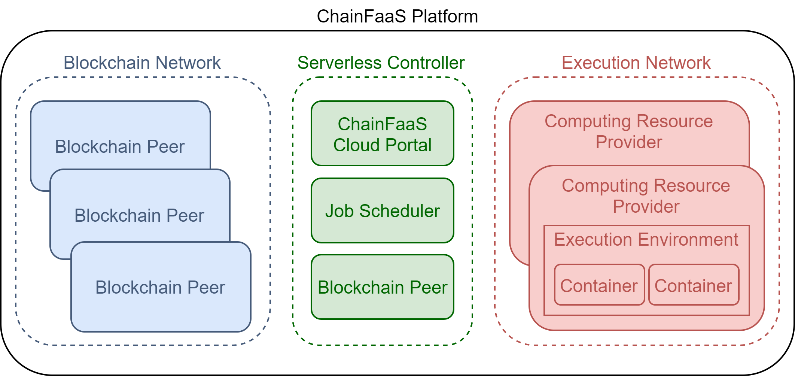

# Components

The following figure shows a high-level architecture of ChainFaaS. This platform has three main parts. The blockchain network consists of all the blockchain peers who are responsible for keeping track of the transactions on the platform. The serverless controller manages the cloud portal and the job scheduling task. The computing resource providers cooperate to shape the execution network.

<!-- <object data="http://yoursite.com/the.pdf" type="application/pdf" width="700px" height="700px">
    <embed src="http://yoursite.com/the.pdf">
        
This browser does not support PDFs. Please download the PDF to view it: <a href="http://yoursite.com/the.pdf">Download PDF</a>.

    </embed>
</object> -->