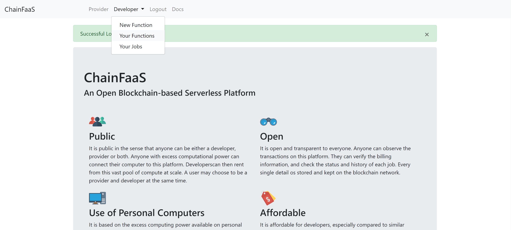
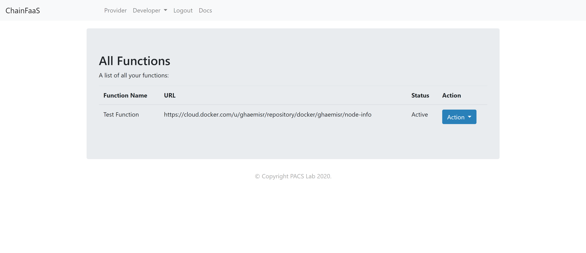

# Getting Started

In the current prototype of ChainFaaS, you can participate in the network as a provider or a developer. Since the platform is still running on a test netowrk, no real currency is exchanged in the transactions. To use the test ChainFaaS network, you should first register in [the port chainfaas.com](https://chainfaas.com/) and login to your account. During the registration, you can choose to participate as a provider or a developer or both. 

## Developers

As a developer, you can run you functions on this serverless platform. The functions should be uploaded as Docker containers to the [Docker Hub](https://hub.docker.com/). You would need the link to your container to create a new function on ChainFaaS. 

When you create a new account on ChainFaaS, an example function is automatically added to your account so that you can explore the functionalities of the platform. After a successful login, under the developer tab, go to "Your Functions" to see the test function. 

In the "Your Functions" page, you can see a list all the functions you have added to ChainFaaS as well as their status. For each function, you can activate the following actions:

* **Stop Function:** If the function is active, you can stop the function to disable the function in the ChainFaaS network. When a function is disabled, no one can send requests to this function. 

* **Send a Request:** Choosing this action will send a synchronous request to the function. The page will go to a loading mode till a response is received from ChainFaaS. This may take a few seconds to finish.   

* **Send an Async Request:** Choosing this action will send an asynchronous request to the function. Instead of directly receiving the response, you can check the status of the job and the response in the Developer tab under "Your Jobs".

* **Delete Function:** This action will delete the function from your functions list.

## Providers

To become a computing provider in ChainFaaS, you need to download and run the prvider's code on your computer. 

The following are the prerequisites:
* Python 3.6 or greater
* Docker 18.01 or greater - prefered version: 19.03

For installation instructions on Linux follow the steps provided on [the ChainFaaS computer provider page on GitHub](https://github.com/pacslab/ChainFaaS/tree/master/ComputeProvider).