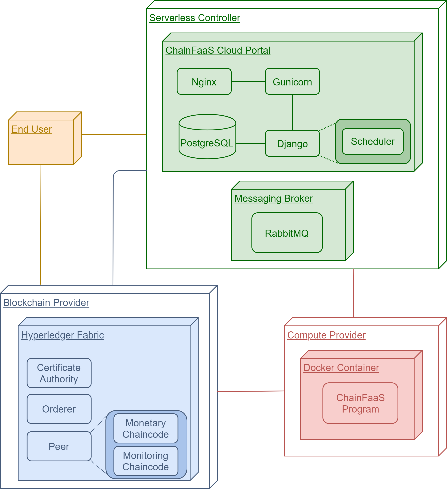
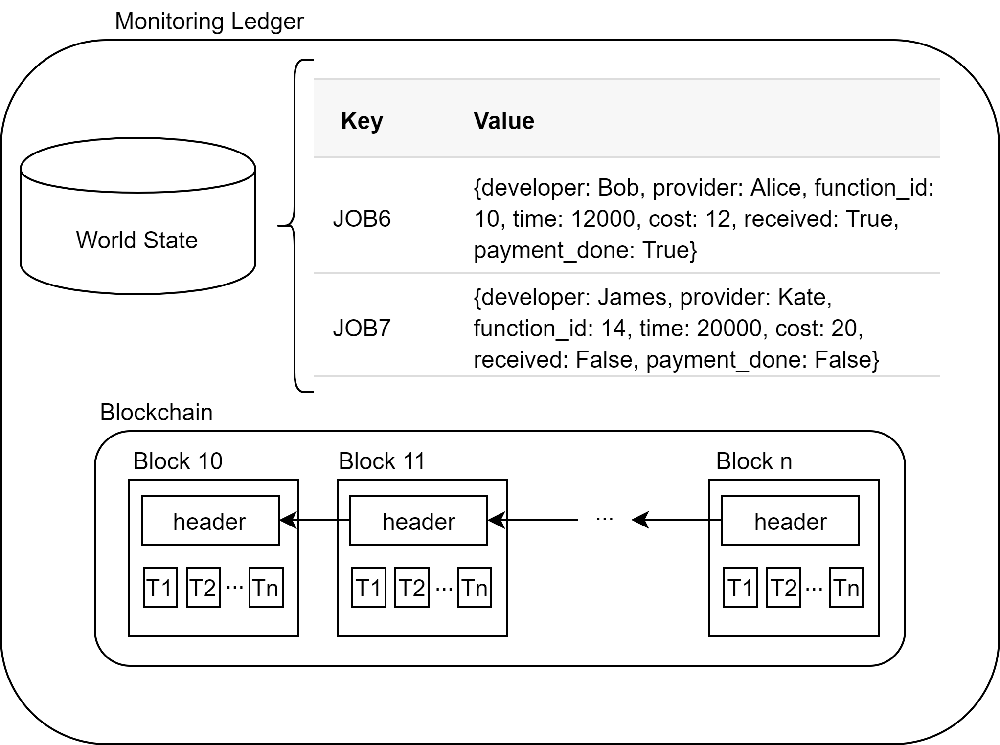
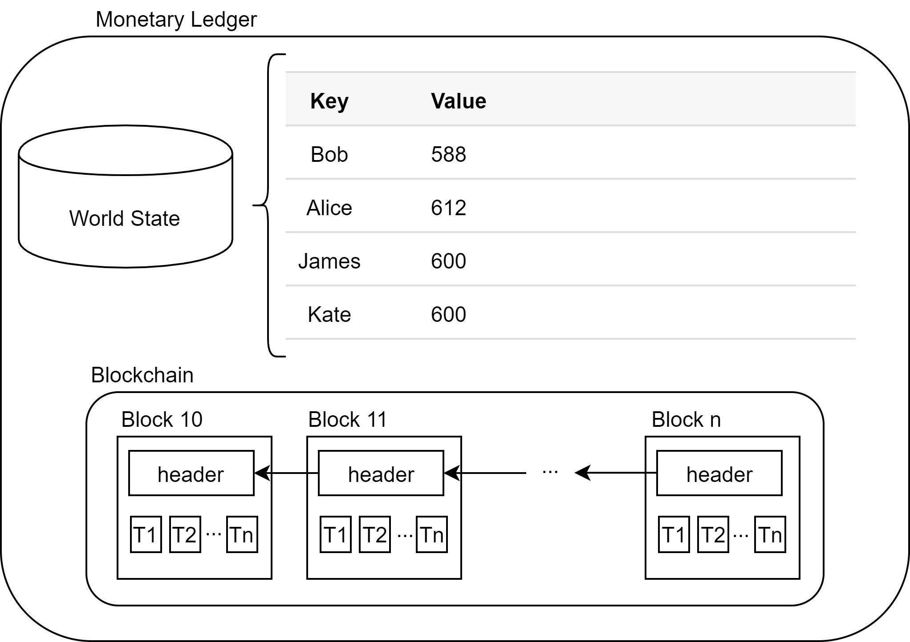
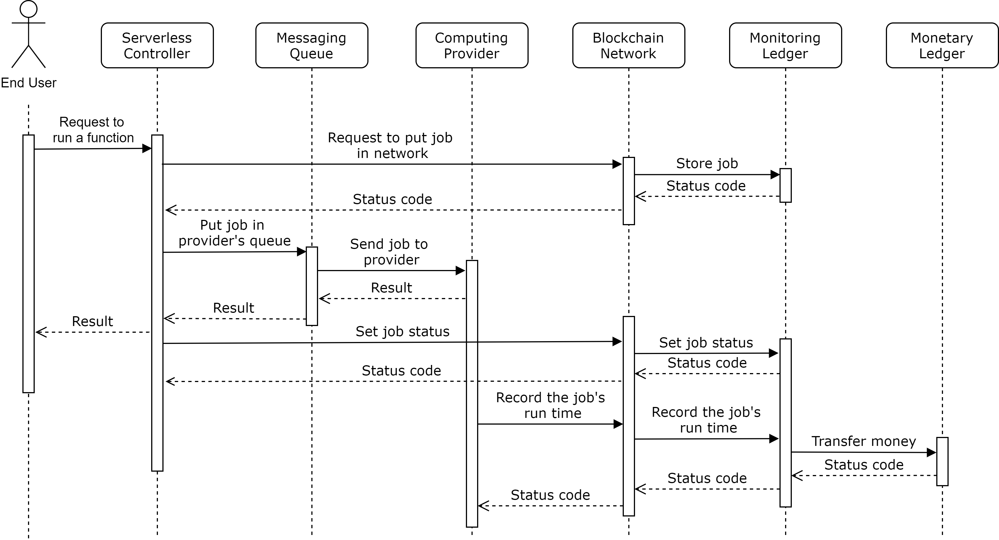

# Implementation and Deployment

To demonstrate the feasibility of our design, we have implemented a prototype of ChainFaaS as a proof-of-concept. In this section, we present the details of the implementation and deployment of this prototype. Details of ChainFaaS implementation, including [the complete code base, can be found on GitHub](https://github.com/pacslab/ChainFaaS). The following image shows the implementation and deployment view of ChainFaaS. The end-user represents the person who sends a request to a function. The end-users are FaaS users that can be the developers themselves, or their users who want to access the functions provided by the developer on ChainFaaS. 

## Serverless Controller

The controller has three main parts: cloud portal, job scheduler, and blockchain peer. The cloud portal is responsible for all interactions between the controller and the users. At the back-end of the web application, the job scheduler is also implemented. We have implemented a simple scheduler that randomly selects a provider from the available providers that can fit the request. The blockchain peer is just like other blockchain peers.

In our implementation of ChainFaaS, the serverless controller is running on an instance with 4 VCPUs, 15GB RAM, and 83GB disk with Ubuntu 18.04. The cloud portal is written in Python using the [Django web framework](https://www.djangoproject.com/). The job scheduler is also implemented in the backend of the cloud portal. [Gunicorn](https://gunicorn.org/) is used as the application server, and [Nginx](https://www.nginx.com/) is used as a reverse proxy. Gunicorn is a Python Web Server Gateway Interface (WSGI) HTTP server that communicates with the Python application. Gunicorn optimally creates as many instances as needed from the web application, distributes the requests between them, and restarts them if necessary. Nginx is used as a reverse proxy to Gunicorn to handle all incoming requests. 

New users can use the ChainFaaS cloud portal to register. Each user should select what role they want to play in the platform: developer, provider, or blockchain peer. After registration is complete, the user can start interacting with the platform. As a developer, the user can submit the link to their Docker container in the Docker registry and set its characteristics. 

When the scheduler matches a provider with a job, there should be a way for the serverless controller to inform the provider of the link to the function and all its information. Since providers are personal computers, they are not directly accessible by the controller. As a result, in ChainFaaS, a messaging queue has been implemented to manage the interactions between the serverless controller and each provider. [RabbitMQ](https://www.rabbitmq.com/) has been chosen as the messaging broker for this system since it is a lightweight open-source broker that can be customized for different applications. During the registration step, the providers are also registered in the messaging broker to be able to access the appropriate queue. Each provider has its own queue that only the serverless controller and the provider can access. The serverless controller puts the jobs in the provider's queue, and the provider fetches it from the queue.

## Compute Provider

On providers' computers, ChainFaaS runs a program that is written in the Python programming language. As long as the program is running on the provider's computer, it receives new jobs from the serverless controller, runs them, and waits for other jobs. Jobs run in isolated environments using Docker containers to keep them from interfering with the provider's computer and accessing their files. In ChainFaaS, having isolated environments for the jobs is particularly important since the provider may not necessarily trust the source of the job. Moreover, there may be more than one job running on the provider's computer at the same time. Using sandboxing solutions, we can ensure there is no conflict between the dependencies and resources of the jobs.

A popular solution for isolating the execution environment of software is using virtual machines. In this solution, a guest operating system runs on top of a host operating system and has virtual access to the system's underlying hardware. Another solution is using containers, which also provide an isolated environment for running a software service. Unlike virtual machines that virtualize the hardware stack, containers provide the developers with a logically isolated operating system by virtualizing the computer resources at the OS-level. As a result, compared to virtual machines, containers are far more lightweight, faster to start, and use far less memory. In the current implementation of ChainFaaS, the security and privacy concerns of providers are addressed using containers as the sandboxing solution. The reason for this choice is that the providers should be able to start using the platform with minimal effort and overhead. As discussed earlier, containers are fast, lightweight, and they provide the required isolated execution environment.

For more details on the security challenges of open platforms and a comparison on different solutions, refer to [the peer-reviewd paper of ChainFaaS](https://ieeexplore.ieee.org/document/9143110). 

## Blockchain Peer

The blockchain used in ChainFaaS is implemented using Hyperledger Fabric V1.4. When choosing the blockchain solution, one of the most important criteria was its energy consumption. One of the initial motivations for developing this platform was to decrease the carbon emission of the ICT ecosystem by increasing the usage of personal computers. However, blockchains that use proof of work as their consensus mechanism, such as Bitcoin, require computationally powerful computers to solve meaningless puzzles to get rewards. On the other hand, in Hyperledger Fabric, there is no need for solving such problems since the consensus algorithm is not based on proof of work. Moreover, Hyperledger Fabric has been designed explicitly for enterprises and takes into account their needs. In Hyperledger Fabric, everything is highly configurable and can be customized for different use cases. These features make it an excellent choice for ChainFaaS. The reason for selecting V1.4 is its stability and long term support. It is the first version with long term support, while V2.0 is still under development.

In the current implementation of ChainFaaS, all components of the Hyperledger Fabric network have been deployed on an instance with 8 VCPUs, 16GB RAM, and 160GB disk with Ubuntu 18.04. There is one Fabric Certificate Authority (CA), one Solo orderer, and two organizations, each with two peers. In the future version of ChainFaaS, there can be included more of these components, each running on different computers. Anyone with a public IP can run the blockchain peers. Each peer stores all the latest information about the ledgers and verifies the new transactions.

We are using chaincodes, which are Hyperledger Fabric's smart contracts, to implement the functionalities needed for ChainFaaS in the blockchain. There are two main chaincodes: monitoring and monetary. The monitoring chaincode is responsible for keeping track of every job that has been served in ChainFaaS. The following image shows the monitoring ledger with an example. Anything that is stored on Hyperledger Fabric blockchain is shown by a key-value pair. In the case of monitoring ledger, the key is the job ID, and the value is its developer, provider, function ID, time, cost, received, and payment-is-done information. The time shows the time the provider spends on running the function, received shows whether the end-user has received the result, and payment-done shows whether the payment has successfully taken place. Monitoring ledger keeps track of all changes that happen to each job. Consider JOB7 as an example. Right now, the job has finished, but the end-user has not yet received the result. As soon as the end-user receives it, a new transaction is created that consists of the change of JOB7's received value from False to True. The world state database is part of the Hyperledger Fabric structure and stores the latest version of every job. In other words, if anyone follows all the changes in the blocks from genesis to the last block, they will reach the value inside the world state. This implementation makes it easy to query the latest values very fast.

The monetary chaincode is responsible for keeping track of user account balances. The key in this ledger is the username of the user, and the value is how much they own in ChainFaaS. The following image shows the details of the monetary ledger. Similar to the monitoring ledger, the blockchain keeps track of changes that happen in accounts, and the world state stores the latest version of account balances. To better understand the functionality of the two ledgers, consider the examples shown in two images. Imagine that before JOB6 and JOB7, Bob, Alice, James, and Kate all had 600 units of money in their accounts. As soon as JOB6 is finished and received by the end-user, the cost (12 units) is deducted from Bob's account and added to Alice's account. Since the end-user has not yet received JOB7, the account balance of James and Kate has not changed.

## The complete process

The sequence diagram shown in the following image describes the process in which the prototype of ChainFaaS serves a request from an end-user. In the current implementation, the result storage is the serverless controller. 

When the serverless controller receives a request to run a function, the scheduler first finds an active provider capable of serving the request. When a provider is found, the controller asks the blockchain network to store the job on the monitoring ledger. In this step, the job is created in the ledger and information such as the developer, the provider who is supposed to execute the job, and the function ID is set. The controller then puts the job in the provider's messaging queue. The provider fetches the job from the queue, runs the Docker container, and sends back the results to the controller to be accessed by the end-user. As mentioned earlier, the serverless controller is set as the result storage for the prototype implementation. In the future versions of ChainFaaS, the result storage will be chosen by the developer. After receiving the result, the controller confirms that the result has been received by setting the status of the job in the blockchain network. In the meantime, the provider also sets the time it took to run the function. The provider is only able to set the run time if the job has already been created by the controller in the blockchain network. Moreover, only the provider that has been assigned to the job can set the run time metrics. This ensures that others cannot tamper with the job's information in the blockchain network. When the monitoring chaincode receives both the confirmation from the controller and the run time from the provider, the service fee will be transferred to the provider's account from the developer's wallet. 

