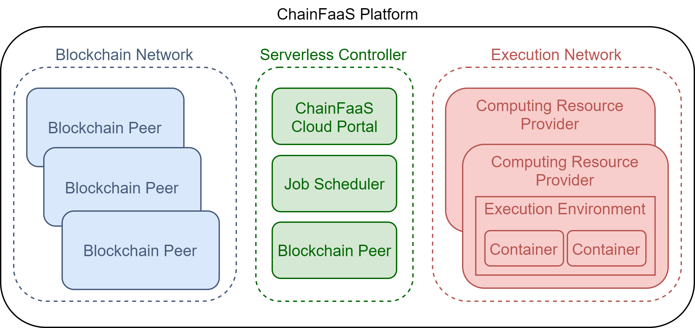

# Introduction

The following figure shows a high-level architecture of ChainFaaS. This platform has three main parts. The blockchain network consists of all the blockchain peers who are responsible for keeping track of the transactions on the platform. The serverless controller manages the cloud portal and the job scheduling task. The computing resource providers cooperate to shape the execution network.

## Blockchain Network

The blockchain network has two main tasks: keeping records of all transactions and managing payments. From now on, we will refer to the record-keeping ledger and payment management ledger as *monitoring ledger* and *monetary ledger*, respectively. Every single transaction is stored and kept by all blockchain peers on the monitoring ledger. Any user can easily access the information of a job and see how it has evolved over time. Information such as the owner of the job, the computing resource provider who has been responsible for the job, the time it has taken to run the job, and its cost, are accessible through the monitoring ledger. The transparency feature of ChainFaaS is achieved through the monitoring ledger. The monetary ledger stores the financial account information and account balances of the users. Every time a job is successfully executed by a provider (i.e., a personal computer owner), this monetary ledger automatically transfers the cost from the developer's account to the provider's account. 

The blockchain network comprises many peers that can be owned by different proprietors. Each peer keeps records of all the transactions occurring in the network. To add a new transaction to the ledger, the peers should reach a consensus on whether to accept the transaction or not. The peers receive a commission for each transaction because of their contribution to the network. It is worth mentioning that a blockchain peer can also act as a computing resource provider in the execution network, which results in having two sources of income from ChainFaaS.

## Serverless Controller
The serverless controller acts as the gateway and is responsible for providing [the portal of ChainFaaS](https://chainfaas.com), which is publicly available. This portal is designed to help all users easily interact with the platform. Based on their enrolment in the system, users can submit new jobs, observe the status of their job, and monitor their contribution to the network. 
Moreover, the controller handles the job scheduling by finding a computing resource provider for each job. The job scheduling is based on a selection algorithm that may take into account many criteria to choose the provider, including the provider's availability and the computational power needed for the job.
The serverless controller also acts as one of the blockchain peers and, just like any other blockchain peer, it receives a commission for the transaction. 

## Execution Network
The execution network consists of all computing resource providers. Anyone can easily connect their extra computational resources or their underutilized online computers to this network. This includes but is not limited to, personal computers, servers, and cloud resources. These providers get paid based on the time they spend on running the job to which they are assigned. Each job runs in an isolated execution environment on the provider's computer to ensure that it does not interfere with the provider's programs. This is also required to prevent different jobs from interfering with each other.