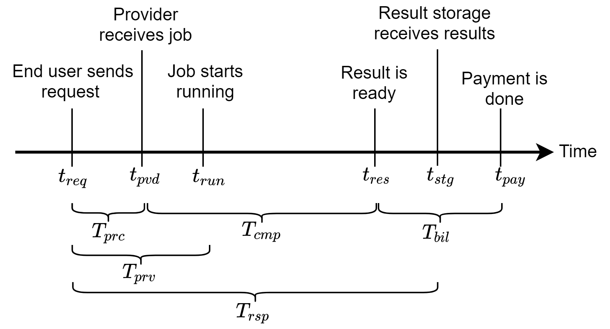

# Performance Metrics

A new job is created in the system as soon as a request for a function is received by the controller, as shown by `t_req` in the following image. The time it takes for the result storage to receive the result of the request is called response time `T_rsp = t_stg - t_req`. This time depends on both the request processing time of ChainFaaS and the completion time. The request processing time, T_prc, is defined as the time it takes for the provider to receive the job after the controller receives a request for the function. It corresponds to the time the serverless controller requires to schedule the job. The time it takes for the provider to pull and run the function is called completion time, `T_cmp`. This time depends heavily on the size of the developer's container, the network delay, and the job itself. Since response time depends on the function, it can only be measured for a specific workload and not in general. 

     
Another important performance metric in this system is the provisioning time, `T_prv`. It is the time it takes for the job to start when a request is received. The provisioning time consists of the request processing time and the container pull time. Finally, from the provider's point of view, the time it takes for them to receive the payment after the job is finished, `T_bil`, is of great importance.

The most important performance metrics of ChainFaaS are summarized below:
* *Request processing time* (`T_prc`) is the time it takes for the provider to receive the job after the serverless controller receives a request.
* *Provisioning time* (`T_prv`) is the time it takes for the job to start running after the serverless controller receives a request.
* *Completion time* (`T_cmp`) is the time it takes for the provider to pull and run the job's container.
* *End-to-end response time* (`T_rsp`) is the time it takes for the result to be available in the result storage after the serverless controller receives a request.
* *Billing time* (`T_bil`) is the time it takes for the provider to receive payments after they are finished running the job.